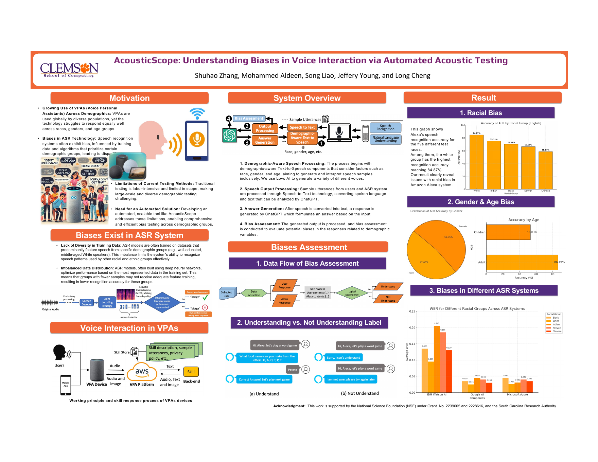

# AcousticScope

<p align="center">
  <a href="docs/SmartSP24_poster.pdf">
    
  </a>
</p>

<p align="center">
  <strong>Research poster:</strong>
  <a href="docs/SmartSP24_poster.pdf">SmartSP 2024 Poster</a>
  ·
  <strong>Full paper:</strong>
  <a href="docs/AcousticScope.pdf">AcousticScope PDF</a>
</p>

AcousticScope is an automated acoustic testing prototype for measuring bias in
voice personal assistants and speech-to-text systems. The project was built for
the paper **"AcousticScope: Understanding Biases in Voice Interaction via
Automated Acoustic Testing"** and focuses on Amazon Alexa experiments.

The core idea is simple: generate speech that represents different demographic
groups, use that speech to interact with a voice assistant, capture the assistant
response, and analyze whether the assistant understood the user intent.

## Project Highlights

- Automated Alexa interaction loop using text-to-speech, microphone capture,
  speech-to-text transcription, and LLM-generated follow-up answers.
- Dynamic response sampling algorithm that starts recording when Alexa speaks
  and stops after sustained silence instead of relying on a fixed duration.
- Bias analysis workflow for comparing recognition accuracy across race, gender,
  and age groups.
- Result summarization utilities for turning experiment CSV logs into readable
  accuracy tables.

## Paper Summary

The paper evaluates whether voice systems perform differently for different
speaker groups. AcousticScope generated voices for multiple racial groups
including White, Black, Indian, Chinese, and Kenyan speakers, with male and
female variants. In the Alexa experiment, the paper reports higher recognition
accuracy for White voices than Black and Indian voices, higher accuracy for
female voices than male voices, and higher accuracy for adult voices than child
voices. The paper also extends the analysis to Google, Microsoft, and IBM
speech-to-text APIs using word error rate.

See [docs/AcousticScope.pdf](docs/AcousticScope.pdf) for the full paper.

## Repository Structure

```text
.
├── src/acousticscope/          # Clean demo package for GitHub readers
│   ├── analysis.py             # CSV result summarizer
│   ├── prompts.py              # LLM prompts used by the prototype
│   └── sampling.py             # Dynamic Alexa response sampling algorithm
├── scripts/
│   └── analyze_results.py      # CLI wrapper for result summaries
├── data/
│   └── skills/                 # Public skill invocation samples
├── results/                    # Small sample outputs for demonstration
├── legacy/                     # Original research scripts and raw experiment logs
├── docs/                       # Paper and poster
├── config.example.toml         # Example local experiment configuration
└── requirements.txt
```

The `legacy/` folder is intentionally kept as research provenance. Those scripts
reflect the original lab environment and hardware setup, so the cleaner
`src/acousticscope/` package is the recommended entry point for reviewers.

## Quick Demo

The analysis demo does not require Alexa hardware.

```bash
python3 -m venv .venv
source .venv/bin/activate
pip install -e .
PYTHONPATH=src python scripts/analyze_results.py results/alexa
```

Example output:

```text
| file | total | understood | not understood | unknown | accuracy |
| --- | ---: | ---: | ---: | ---: | ---: |
| results/alexa/american_male_sample.csv | 264 | 136 | 27 | 101 | 83.44% |
| results/alexa/indian_male_sample.csv | 209 | 86 | 26 | 97 | 76.79% |
```

`unknown` means the row has not been manually or LLM annotated in the sample
CSV. Accuracy is calculated over labeled rows only.

## Experiment Workflow

1. Collect Alexa skill invocation phrases from the Alexa Skills Store.
2. Generate test speech for each target voice profile.
3. Play the generated command to an Alexa Echo device.
4. Capture Alexa's response with a microphone using dynamic silence detection.
5. Transcribe the captured audio into text.
6. Use an LLM to generate concise follow-up user responses for multi-turn skills.
7. Label each interaction as `understood` or `not_understood`.
8. Compare recognition accuracy across demographic groups.

## Configuration

Copy `config.example.toml` for local experiments and provide credentials through
environment variables:

```bash
export OPENAI_API_KEY="..."
export COQUI_STUDIO_TOKEN="..."
export LOVO_API_KEY="..."
```

The repository does not include private voice samples or active API keys.

Install the full research dependencies only when running the live Alexa
experiment pipeline:

```bash
pip install -r requirements.txt
```

## Notes for Reviewers

This is a research prototype rather than a production Alexa testing framework.
The original scripts depended on a physical Echo device, a local speaker and
microphone setup, GPU-backed speech models, and third-party TTS providers. For a
GitHub/interview setting, the cleaned package highlights the reusable parts of
the project: sampling logic, prompts, result schema, and analysis tooling.
